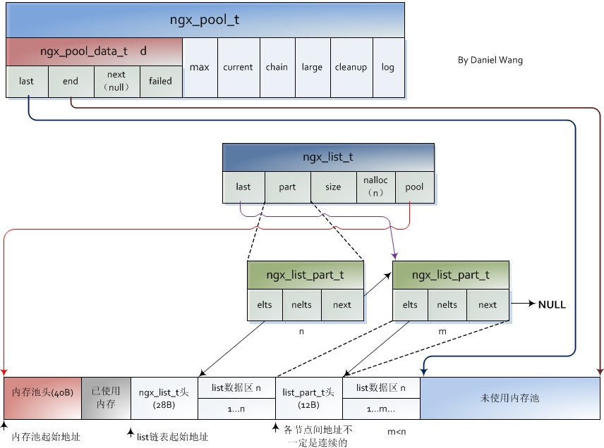

# Distributed System Course Project

## 					E-commerce Spike Simulation

###王泽宇 赵海凯 谢天翊


## 1.Requirment Analysis

- Consistency: Stock is low, therefore requests are a lot more than the stock. During the processing of concurrent updating operation, we need to prevent the scenario of overselling. 
- High usability: Ensure that the serive system can endure large request influx, and mechanisms are needed to prevent the system from failure or crushing.
- Transparency
  - Access transparency, location transparency, and mobile transparency: can be automatically implemented by the http protocol and the Internet and Ethernet.
  - Performance transparency: spikes involve a large number of concurrent reads and concurrent writes, and network traffic surges, network bandwidth pressure will increase, so we must support high concurrent access. When the load is explosive, the server can automatically configure it to improve performance.
  - Concurrency transparency: A large number of request threads cannot interfere with each other. This is a core part of system design.
  - Scalability and transparency: When the server performance is upgraded or several servers are added, the performance can increase approximately linearly.
  - Fault transparency: when a server fails, it will not cause a complete crash of the service, and there is a certain fault tolerance mechanism
- Simplification of the procedure of the operation: Submit the order --> Reduce the stock --> Pay for the bill
- The problem of multiplt reading and little writing: Most HTTP messages are for read method compared to the writing messages which are relatively little. So enhancing the reading speed of the database would be one of the key to elavate the performance.

## 2.Design strategy

All measure are intended to intercept the request at the upper stream, minimizing the access request to the database as many as possible. 

- Flux limit

Concept: First block most of the user flow with a max limit server ability, and then only an acceptable number of users are able to access the backend server.

Implementation Method: Redis token bucket limitation algorithms block the majority of the flow.

- Peak clipping

Concept: The spike request is highly concentrated on a certain point in time, and the instantaneous traffic will easily overwhelm the system. Therefore, it is necessary to perform peak clipping on the instantaneous traffic, buffer the instantaneous traffic, and decouple the time, so as to allow the server to gently handle the resources

Implementation Method: A large number of order requests first enter the queue through the Kafka queue, and then slowly dequeue.

- Asynchronization

Concept: When creating the order, accessing Redis to check whether the stock is enough is needed. only a small partition of the requests that succeeded can create orders.

Implementation Method: We put the information of the merchandise in the buffer in Redis to reduce the access to data base.

- Use the cache fully

Concept: When you create an order, you need to query Redis every time to determine whether the inventory is sufficient. Only a few successful requests will create an order.

Implementation Method: Product information can be placed in the Redis cache to reduce database queries.

- Load balancing

Concept: Requests sending to a single server would overload the server and potentially cause the server to break down. If there are a number of servers, we can distribute the requests over to different servers to reduce the pressure of one single server.

Implementation Method: Nginx can be used as a load balancer. In our case, as we have 8 servers, and also due to the the flexibility of Nginx, there are two solutions. The first one is to send the requests using the Round Robin, sending to the servers. The second one is to distribute the requests by URI. 


## 3.The solution to data security in high concurrency

- The phenomenon of selling more merchandise than the stock

Suppose in a limited-time offer scene, we have 100 merchandise in total. At the last moment, when we have already sold 99 merchandises and multiple requests come in simultaneously. These requests by reading the data base get the quantity of the remaining merchandise, which is one, and all of them rush to buy the good, resulting in selling more than we have at hand. This the scenario that we are trying to avoid.

### Solution analysis

- The 4 levels of Isolation of transactions at the level of MySQL:

  In the theory of data base, the Isolation of transactions is a trade-off with the through put of the transaction in data base. Strict Isolation of the transactions can ensure ACID, but it put to much limit on through put, suitable for the kind of transactions that require absolute consistency, like banking systems. But in our case, it would bring too much delay, leading to a great buying latency, meaning that it isn't suitable. Thus, based on different process that are suitable or not, mysql raised 4 levels of transaction isolation.

  - READ UNCOMMITTED: It does not require transactions to be isolated, which can lead to dirty reads. This non-isolation does not apply to shopping systems.

- READ COMMITTED : There is a certain transaction isolation. And to avoid dirty reading, one thread cannot read transactions that are not committed by another thread. There are also problems of phantom reading.

  - REPEATABLE READ: Stronger transaction isolation. It uses the MVCC (Multi-Version Concurrency Control) mechanism, which is actually the realization of an optimistic locking concept. Thread A's read operation will not update the version number. At this time, other threads have modified the data, and even if they submit, they will not read it for thread A. The thread does not update the version number when reading, so it reads the historical version. When writing, it will update the version number to the latest version. When the write fails to meet the consistency condition (merge failure), it will be abandoned. Partially solved the problem of phantom reading. This is also the default transaction isolation level for MySQL.
  - SERIALIZABLE :Regardless of reading and writing directly locking the table, other operations cannot be performed, and there is only one user at a certain timetable. The level of concurrency is 1. Completely solved the problem of phantom reading. Data consistency is absolutely guaranteed.

- Distributed lock based on Redis

  ​	The designing pattern of Redis doesn't support transaction. But according to the official documents of Redis we can infer that the ACID attributes of trandaction in Redis can be realized by using Lua script which is based on the API `call` provided by Redis in an atomic way. Which means that in order to realize the attributes of transactions in an distributed environment, programmers need to design a suitable algorithm. 

  Designs of the transactions ususally through CAS(Compare And Set), at the same time set the time out machinism to avoid dead lock.

  In our architecture, Redis-based framework, Redisson was finally adopted to implement distributed locks. The implementation of Redisson will be illustrated in detail later.

- Distributed locks based on Zookeeper

We mainly used the Znode of the Zookeeper file system. Locking happens when a node successfully attempts to create a temporary znode.

At this time, if other clients try to create the lock, it will fail, so you can only register a listener on the lock. Releasing the lock is to delete the znode. Once released, the client will be notified, and then a waiting client can get the lock.

However, if the Zookeeper distributed lock cannot obtain the lock, it only needs to register only one listener, and there is no need to constantly try to acquire the lock, and the performance overhead is relatively small.

Moreover, the semantics of Zookeeper distributed locks are clearer and simpler, eliminating the steps of traversing the lock and calculating the timeout period.

```java
  CuratorFramework curatorFramework = CuratorFrameworkFactory.builder().
                connectString("172.101.8.4").
                retryPolicy(policy).
                build();
  curatorFramework.start();
  //Zookeeper的锁,尝试创建一个znode节点"myMutex"
  mutex = new InterProcessMutex(curatorFramework, "/myMutex");
```

Then before get access to redis, we use mutex.acquire() to get the zk lock, finally we release the lock when the transaction is finished.


## 4. Architecture Design


### 4.1 Before Improvement


- The request first arrives at a Portal Server, where the maximum traffic is limited by the token bucket algorithm, and then the request is hashed to several servers by the Nginx reverse proxy.
- After the Redis update is successful, it will immediately return to the user so that the user gets a response. The order is successfully created. At the same time, a background thread is started to send the order information to the message queue kafka.
- Look up the stock of Redis. if it is not empty, then enter the message queue.
- After get out of Kafka, use to update Mysql. If the version number is consistent, the request for limited-time offer succeeded. then update Redis.
- The version number is out of date, and the request for the merchandise is failed.

Key problem in solving oversell phenomenon: The optimistic lock based on the version number in Mysql.

Bottle neck of the performance: Mysql update rate is slower than expected, therefore lots of the requests are invalid.

#### Assessment of the architecture:

- Low through put: In the test, we found that too much overlapping version number would cause the requests tend to fail, but the disk has already endured the corresponding task, which means that we are using the disk wrongly. In a limited time, lots of IO operation didn't update the stock and create the orders, but checked the orders in turn.
- Concurrency control strategy selection: We selected the concurrent control of manual optimistic locking based on MySQL, however, optimistic locking is not suitable for large-scale write operations. Although the number of write operations in our scenario is relatively small compared to the number of read operations, the absolute number is still large. It is not suitable for optimistic concurrency control and will cause a large number of things to roll back.
- Middleware performance waste: A large number of invalid requests consume the performance of Redis, Kafka, MySQL middleware, which means that the CPU, memory and external storage resources of the service cluster are logically dominated by invalid things. For example, at a certain time, 100 requests flooded into the server, and the version number was 1. The Redis inventory is consistent with the view of all requests at this time; if not empty, these 100 requests can enter the Kafka message queue, but only the request first to dequeue and update MySQL can be successfully executed, and the order is successfully placed. The remaining 99 requests will be abandoned because the version number expires. At this time, the inventory is consumed by only one piece, but the middleware and the server have already undertaken Work load of 100 requests. This problem will become more apparent when the amount of concurrency increases further.
- Oversold phenomenon:
  - For MySQL, the default level of transaction isolation is **REPEATABLE READ**. This means that when the request reads the version number, it is likely that it is not the latest version number. When it is written, it will fail to write, and the user and Redis  will get the error messages.
  - Later, we changed the transaction isolation level of MySQL to **READ COMMITTED**, and there are still problems. Committed reads do not require locking the table. For example, there is 1 item left in the inventory, and two transactions with the same version number. One transaction is opened and the inventory is not submitted. When the other transaction reads, it is found that the version number of the inventory is still appropriate,and start to update as well. When the former transaction submitted, the latter transaction found the version number to be wrong when updating. For the latter transaction, the version number passed checking when reading, and the version number is good when writing, only write will be regarded invalid, and return wrong information to users and Redis.
  - In this case, there is only one last option, **serializable**. When we set the isolation level to be serializable, the throughput again drops significantly.
- Single point of failure: Once a failure occurs, the processing capacity decreases linearly, critical nodes go down simultaneously (such as the Redis master and all slaves), and the system is down.
- Redis current limiting function is limited: Redis is not fully utilized. On the one hand, Redis' role is only to filter part of the requests in the token bucket, it can use limited resources to control the flow, and to block subsequent spike requests after all the products are sold out. Prior to the completion of the spike, Redis even had some redundancy. On the other hand, Redis is updated by both front-end and back-end requests, which also causes a very busy state.

### 4.2 After Improvement：


- The request first arrives at a Portal Server, where the maximum traffic is restricted by the token bucket algorithm, and then the request is hashed to several Servers through the Nginx reverse proxy;
- Each server presets a certain amount of local inventory according to the hardware processing capacity, and at the same time adds a certain amount of buffer to avoid the failure of a single server,which would cause reducing the total local inventory and preventing the product from being sold;
- The Redis cluster is deployed on multiple nodes with good performance to achieve read-write separation. The threads of each server connect to the cluster and try to update asynchronously.
- After the Redis update is successful, it will immediately return to the user so that the user gets a response. The order is successfully created. At the same time, a background thread is started to send the order information to the message queue kafka.
- The kafka background thread continuously obtains messages from the message queue, constructs the environment, synchronizes the information to MySQL, and ensues the transaction isolation level is repeatable.

The key to solving overselling: Before the start of the spike, Redis synchronizes the inventory of MySQL. Redis distributed locks ensure that Redis inventory updates are processed at the transaction level.

Performance bottleneck: The bandwidth of the interface distribution server is limited. On the premise of unlimited bandwidth, Redis distributed locks are a performance bottleneck.

What needs to be improved: When the concurrency reaches a 10 ^ 5 / s, oversold occurs occasionally, that is, the Redisson distributed lock fails.

Solution: For the oversold phenomenon with a very small probability, we roll back the corresponding order and notify the customer when an abnormality is found at MySQL. This is a compromise.

#### Architecture evaluation:

- Transparency:
  - Network transparency: Due to Nginx's reverse proxy and the basic characteristics of the Internet and Ethernet, this property can be guaranteed.
  - Replication transparency: Redis not only has replica replication from slave nodes, but also has its own persistence strategy; messages collected by kafka are persisted on disk; MySQL middleware maintains final data consistency.
  - Fault transparency: Because there is buffer inventory locally on each server, the downtime of a single server does not affect business capabilities, but it will definitely affect processing efficiency. From a middleware perspective, as long as not a group of master and slaves are down at the same time Machine, using the Redis sentinel mechanism can elect a new master to continue processing business as soon as possible; for kafka, if a node goes down, Zookeeper will repartition the partition on the changed node and redistribute it to other normal working nodes; For MySQL, a distributed deployment avoids a single point of failure.
  - Performance transparency: When the load bursts, the token bucket algorithm can deal with and buffer the rectification, nginx can share the request amount, kafka can decouple the request in time, slowly update the background data, and after triple measures, it can handle a large amount of load.
  - Scalability and transparency: When hardware or server resources increase, nginx can increase members to share requests, redis can increase nodes to reduce partitions, reducing the processing pressure of each node; Kafka can increase the number of nodes in the cluster, thereby increasing the number of partitions. The original partition load will be redistributed, and the final processing throughput will be improved.
  - Concurrency transparency: This property can be guaranteed as much as possible, but due to the underlying communication mechanism of Redis, occasionally a very small number of thread interferences will occur during high concurrency. This problem has been artificially intervened in MySQL. This is a current  problem that our project needs to improve.
- Performance bottleneck moved forward: Without considering bandwidth limitations, the performance bottleneck was moved from the original MySQL heavyweight read and write to the Redis memory database (mainly for distributed lock processing), which greatly improved performance.
- Redis utilization optimization: Redis no longer processes requests before and after, only accepts requests from front-end servers, processing power is improved, and concurrency control pressure is greatly reduced.
- The performance of middleware is greatly improved: part of the invalid requests are intercepted by the token bucket algorithm in the Portal Server, part of the intercepted requests are intercepted in the local server, and the last part is intercepted in querying Redis. Extremely accidental requests will go to external storage and access MySQL. Therefore, the hardware is almost always running for efficient request processing logic.
- Concurrency control strategy selection: The main concurrency conflict was moved from MySQL to Redis, and the concurrency strategy selected the blocking and publish-subscribe model in Redisson RLock to maximize CPU utilization; MySQL did not interfere with the user's response and adopted the most secure serializable` concurrency control mode. However, as mentioned earlier, Redisson's concurrency control still has errors. The reasons and solutions will be detailed in 5.5.2 later.

## 5. Middleware-Redis

### 5.1 Introduction to Redis

Redis is an in-memory data structure store, used as a database, cache and message broker. It supports various data structures. Redis has built-in replication, Lua scripting, LRU eviction, transactions and different levels of on-disk persistence, and provides high availability via Redis Sentinel and automatic partitioning with Redis Cluster.

- Function Interface:

  - class RedisPool: Implements logic about token bucket, local server stock and communication with redis

  - int initRedisBefore(int id, int count)：Initializes Redis
  - void initServerBefore(int id ,int count)：Initializes local server stock
  - void addStockEntry(int sid, int stockNum): adds local server stock
  - Integer localDecrStock(Integer sid): tries to update local server stock after gaining  token from token bucket
  - boolean redisDecrStock(Integer sid, Stock s): tries to update redis stock after updating local server stock
  - void set(String key, long value): It is equal to redis command: SET key value;
  - long get(String key): It is equal to redis command: GET key;
  - long incr(String key): It is equal to redis command: INC key;
  - long decr(String key): It is equal to redis command: DEC key;

- Method Implementation:

  - Initializes Redis Pool

    ```java
        static {
            try {
                initCluster();
            } catch (Exception e) {
                e.printStackTrace();
            }
        }
    
        private static void initCluster() throws Exception {
            Config config=new Config();
            config.useClusterServers()
                    .addNodeAddress("redis://172.101.8.2:8001")
                    .addNodeAddress("redis://172.101.8.3:8002")
                    .addNodeAddress("redis://172.101.8.4:8003")
                    .addNodeAddress("redis://172.101.8.5:8004")
                    .addNodeAddress("redis://172.101.8.6:8005")
                    .addNodeAddress("redis://172.101.8.7:8006")
                    .setPassword("123456")
                    .setScanInterval(10000)
                    .setMasterConnectionPoolSize(100)
                    .setSlaveConnectionPoolSize(100);
    
            cluster = Redisson.create(config);
        }
    ```

  - update local stock, with thread-safe variable type

    ```java
        // 拿到令牌的订单先更新本地库存，变量线程安全，无需额外同步
        public static Integer localDecrStock(Integer sid){
            try {
                Integer stock=serverStocks.get(sid);
                if(stock>0){
                    serverStocks.put(sid,stock-1);
                    return 1;
                }
            } catch (Exception e) {
                e.printStackTrace();
            }
            return -1;
        }
    ```

  - wrap redis variable operations, taking inc as an example, while others are similar.

    ```java
        public static long incr(String key) throws Exception {
            long result=0;
            try {
                RAtomicLong keyObject = cluster.getAtomicLong(key);
                result=keyObject.incrementAndGet();
            } catch (Exception e) {
                System.out.println("listGet key:{} error" + key + e);
            }
            return result;
        }
    ```

### 5.2 Redis on-disk persistence

The main work of Redis is in memory. In order to protect the non-volatile nature of data in memory, Redis uses two persistence strategies to save data. The two strategies are briefly analyzed below, and the choices in this project are explained.

#### 5.2.1 RDB

The RDB persistence performs point-in-time snapshots of your dataset at specified intervals.

According to the setting, the RDB method will check whether the number of writes exceeds n at every t interval, and if it exceeds, the persistence will be performed once.


Whenever Redis needs to dump the dataset to disk, this is what happens:

- Redis forks. We now have a child and a parent process.
- The child starts to write the dataset to a temporary RDB file.
- When the child is done writing the new RDB file, it replaces the old one.

RDB's persistence can be selected through a background process in order to maintain asynchronousness. But there is still huge overhead in creating the fork. At the same time, it should be noted that RDB's persistence strategy adopts full synchronization.

#### 5.2.2 AOF

The AOF persistence logs every write operation received by the server, that will be played again at server startup, reconstructing the original dataset. Commands are logged using the same format as the Redis protocol itself, in an append-only fashion. Redis is able to rewrite the log in the background when it gets too big.


- Redis forks, so now we have a child and a parent process.
- The child starts writing the new AOF in a temporary file.
- The parent accumulates all the new changes in an in-memory buffer (but at the same time it writes the new changes in the old append-only file, so if the rewriting fails, we are safe).
- When the child is done rewriting the file, the parent gets a signal, and appends the in-memory buffer at the end of the file generated by the child.
- Now Redis atomically renames the old file into the new one, and starts appending new data into the new file.

There are several strategies for AOF's rewrite operation: rewrite every update, rewrite every second, and no rewrite at all.

Although the persistence of AOF is also performed through the background, it can be seen that when the background process rewrites the AOF file, the main process is also greatly affected (write records into aof_buf and aof_rewrite_buf). The fork operation when the child process is created also has a large overhead. On the other hand, unlike RDB, the synchronization strategy adopted by AOF is incremental synchronization.

#### 5.2.3 Comparation and Selection

Comparing the two synchronization methods, we believe that RDB's persistence method should be used in the spike system. Synchronize once every few seconds (> = 5 ~ 10) for the following reasons:

- Compared to AOF, the impact on the main process is less during synchronization
- Compared to AOF, it does not keep log records on every update, which affects Redis throughput
- The synchronization subprocess of AOF will reconstruct the data according to the log, which is occupied in the spike system, which is a very precious CPU resource.
- Compared with AOF, there is automatic regulation of flow peaks and troughs
- Because the mode of Redis master-slave replication is log-based, it is slightly redundant to actively write AOF on the local disk.

The configuration file settings are as follows:

```
# 时间策略
save 10 1
save 600 10000
save 3600 10000

# 文件名称
dbfilename dump.rdb

# 文件保存路径
dir $HOME/redis-cluster/8001/data/

# 如果持久化出错，主进程是否停止写入
stop-writes-on-bgsave-error yes

# 是否压缩
rdbcompression no

# 导入时是否检查
rdbchecksum no

# 是否开启aof
appendonly no
```

Even so, if the value of the goods sold is high and needs to be strictly monitored throughout the sale process, the mode of incremental synchronization of AOF with each query should be adopted.

### 5.3 Redis Cluster

#### 5.3.1 Redis Cluster Abilities

Redis Cluster provides a way to run a Redis installation where data is **automatically sharded across multiple Redis nodes**.

Redis Cluster also provides **some degree of availability during partitions**, that is in practical terms the ability to continue the operations when some nodes fail or are not able to communicate. However the cluster stops to operate in the event of larger failures (for example when the majority of masters are unavailable).

In conclusion, the abilities of Redis include

- **automatically spliting your dataset among multiple nodes**.
- **continuing operations when a subset of the nodes are experiencing failures** or are unable to communicate with the rest of the cluster.

The graph below shows our configuration on Redis Cluster.


#### 5.3.2 Redis Cluster Communication

Every Redis Cluster node requires two TCP connections open. The normal Redis TCP port used to serve clients while the second port is used for the Cluster bus, that is a node-to-node communication channel using a binary protocol. The Cluster bus is used by nodes for failure detection, configuration update, failover authorization and so forth.

In our project, port 8001-8006 are for clients, while port 18001-18006 are for internal communication.

#### 5.3.3 Redis Cluster Data sharding

Redis Cluster does not use consistent hashing, but a different form of sharding where every key is conceptually part of what we call an **hash slot**.

There are 16384 hash slots in Redis Cluster, and to compute what is the hash slot of a given key, we simply take the CRC16 of the key modulo 16384. Every node in a Redis Cluster is responsible for a subset of the hash slots.

Below is our configuration about redis cluster:


#### 5.3.4 Redis master-slave replication

1. Initialization from the server
   When the slave server starts, it sends a SYNC command to the master server to request data synchronization. After receiving the message, the main server performs RDB persistence and generates a snapshot file. At the same time, the main server caches the newly executed commands during the snapshot generation. After the snapshot file is generated, the master server sends the RDB snapshot file and the cached command to the slave server. The slave server first loads the received RDB snapshot file, and then executes the cached new command to complete the master and slave data. The initial synchronization operation.
2. Keep sync from the server
   After the slave server is synchronized, all commands received by the master server will be asynchronously sent to the slave server to maintain the consistency of the master and slave data. In this way, the read and write separation of Redis is achieved. The read operation acts on the slave node and the write operation acts on the master node.
3. After the server failure
   When the slave server crashes, initialization after restarting will automatically synchronize the data of the master server. At this time, redis uses the process of incremental replication to synchronize data from the server's initialization.
4. After the failure of the main server
   When the master server crashes, the election algorithm will choose a slave server to upgrade to the master server.

In our project, the classical pattern of 3 master with 3 slaves is adopted.

#### 5.3.5 Redis Sentinel

Sentinel is a process independent of the data server. It is used to monitor the status of the redis data server. When the most critical master server fails in the master-slave mode, it can be automatically detected by the sentry. At the same time, the sentry will **"select"** the new master server among the remaining slave servers to achieve the purpose of automatic recovery system services.

When the sentinel is started, it will establish a connection with the master server and indirectly obtain the information of the slave server to complete the initialization of the sentinel. After the sentinel is initialized, it will periodically communicate with the master-slave server and other sentinel nodes (subscribe / publish via the message channel).

The sentinel sends the **INFO** command to all servers every 10 seconds to get the current status of the relevant redis server in order to determine whether failure recovery is required.

When a sentry does not receive a response from the main server within the specified time period of **down-after-milliseconds**, the current sentinel **“subjective”** considers the main server to be offline and vote with other sentries monitoring the current system. Decided that when the number of voting decisions in the current sentinel configuration is exceeded, the current sentinel **"objective"** considers that the master server is offline, and the sentinel cluster will elect a leading sentry to switch the master-slave server cluster status Raft algorithm).

​	Below shows how our project configures sentinel:

```
//监控master
sentinel monitor "master" "172.101.8.2" "18001"　

//确认连接密码
sentinel auth-pass "master" 123456

//设置宕机时长
sentinel down-after-milliseconds "500"　

//每次发生宕机，只有一个slave不继续参与命令处理
sentinel parallel-syncs "master" 1 
```

On the one hand, in the spike of system bandwidth and its preciousness, we do not want sentries to mistakenly believe that the main server is down due to network congestion, and use precious time and resources to execute the election algorithm and restart the main data node; on the other hand, we also do not want The delayed master node cannot be detected lately, which greatly reduces the efficiency of Redis update operations. To balance the trade-offs, we set the downtime to 500ms.

#### 5.3.6 Shortage on Redis Cluster

Redis Cluster is not able to guarantee strong consistency. In practical terms this means that under certain conditions it is possible that Redis Cluster will lose writes that were acknowledged by the system to the client. Thereason why Redis Cluster can lose writes is because it uses asynchronous replication. Although no crash happens, if redis client asks data for the slave nodes, then consistence can not be guaranteed. To overcome this problem, continuous procedures are expected to detect this exception. After all, this kind of exception happens at a pretty low frequency.

### 5.4 Token Bucket Algorithm


The token bucket algorithm is mainly used to limit traffic. Tokens are generated and added to the token bucket at a constant speed. Each request can continue to process business logic after the token is obtained. Requests that do not obtain a token are directly rejected. There are two reasons to use the token bucket algorithm:

1. Limiting concurrent traffic can maintain the maximum traffic to the upper limit of the existing server processing capacity;

2. Compared with other traffic limiting algorithms, it has the ability to deal with sudden traffic. Before the spike, the token bucket can be filled to reach the upper limit of the processing capacity to ensure the throughput.

- Function interface

  - boolean RedisPool.acquireToken (): apply for a token, return true if successful, otherwise return false

- Method implementation:

  - TokenBucket private class

    Because the token bucket is operated by a single machine and a single process, there is no need to set a separate lock. Using the synchronized feature of Java, only one thread can manipulate the tokens variable at a time.

    ```java
    class TokenBucket{
        private Integer tokens=50000;
        private static Integer maxTokens = 500000;
    
        public synchronized Integer getToken(){
            return tokens;
        }
    
        synchronized void incrToken(){
            if(tokens<maxTokens)
                ++tokens;
        }
    
        synchronized boolean decrToken(){
            if(tokens<=0)
                return false;
            --tokens;
          return true;
        }
    }
    ```

  - Methods of the RedisPool class involving token buckets:

    Use @Scheduled annotation to call timing method

    ```java
        // 每1ms，令牌桶中令牌增加一个，可以根据服务器处理能力进行调整
    	@Scheduled(fixedRate = 1)
      private static void incrTokenBucket(){
            bucket.incrToken();
        }
    
        public static boolean acquireToken(){
            return bucket.decrToken();
      }
    ```

    

### 5.5 Redisson

Redis' native transaction features are implemented based on optimistic locking and CAS mechanisms, which caused two problems in this project:

1. Optimistic locks are not suitable for scenarios with high concurrency, a large number of Redis update requests will be discarded, wasting CPU and memory resources;
2. The simple CAS mechanism is prone to ABA problems, that is, the data is determined to be A at the beginning of the execution of transaction 1, and the data is changed to B during transaction 2 and then changed to A at transaction 3. The comparison is correct when the update is submitted The submission was successful, but the data is actually dirty.

Based on these two reasons, especially the first one, we abandoned the use of Redis' native transaction features and switched to using Redis-based distributed framework Redisson.

##### 

#### 5.5.1 Redisson lock and release

Redisson locking is actually implemented by executing Lua scripts through Redis's eval instruction. The basic idea of Redisson locking is to set an hset, key is the lock ID, field is the host UUID plus the thread UUID, and value is the lock reentry lock. To avoid deadlocks, locks have a certain timeout period and are automatically released when the timeout expires.

In order to avoid that the lock has timed out before the business logic is completed, Redisson has set a watchdog to monitor whether the lock is still occupied every 1/3 of the timeout period, and refresh the lock timeout if it is still held.

In addition, redisson's locking mechanism is not busy waiting, but based on the publish and subscribe model in the java.util.concurrent package. First, the thread subscribes to the lock. If the lock is occupied, it waits for notifications; when the lock owner releases it, After publishing the message, the subscriber can "grab" the lock again.

```lua
"if (redis.call('exists', KEYS[1]) == 0) then " +
                  "redis.call('hset', KEYS[1], ARGV[2], 1); " +
                  "redis.call('pexpire', KEYS[1], ARGV[1]); " +
                  "return nil; " +
              "end; " +
              "if (redis.call('hexists', KEYS[1], ARGV[2]) == 1) then " +
                  "redis.call('hincrby', KEYS[1], ARGV[2], 1); " +
                  "redis.call('pexpire', KEYS[1], ARGV[1]); " +
                  "return nil; " +
              "end; " +
              "return redis.call('pttl', KEYS[1]);"

```

1. If you find that the current key does not exist through the `exists` command, that is, the lock is not occupied, execute` hset` to write Hash type data **key: global lock name** (such as shared resource ID), **field: Lock instance name** (Redisson client ID: thread ID), **value: 1**, and execute `pexpire` to set the expiration time for the key, returning the null value` nil`, and the lock acquisition is successful.

2. If you use the `hexists` command to find that the Hash data of the current key and field already exists in Redis, it means that the current thread has acquired the lock before, because the lock here is **reentrant**, then execute` hincrby` The value of the current key field is **increased by 1**, and the expiration time is reset, and a null value is returned. At this point, the reentry lock is successfully obtained.

3. Finally, the lock has been occupied, that is, the current key already exists, but the Field in the Hash is different from the current value, then execute `pttl` to obtain the remaining life time of the lock and return, so far the lock acquisition fails.

Similar to Redisson lock, Redisson release lock is also completed by lua script:

```lua
 "if (redis.call('exists', KEYS[1]) == 0) then " +
                        "redis.call('publish', KEYS[2], ARGV[1]); " +
                        "return 1; " +
                    "end;" +
                    "if (redis.call('hexists', KEYS[1], ARGV[3]) == 0) then " +
                        "return nil;" +
                    "end; " +
                    "local counter = redis.call('hincrby', KEYS[1], ARGV[3], -1); " +
                    "if (counter > 0) then " +
                        "redis.call('pexpire', KEYS[1], ARGV[2]); " +
                        "return 0; " +
                    "else " +
                        "redis.call('del', KEYS[1]); " +
                        "redis.call('publish', KEYS[2], ARGV[1]); " +
                        "return 1; "+
                    "end; " +
                    "return nil;",

```

1. The key does not exist, indicating that the lock has been released. Execute the `publish` command directly to release the lock release message and return` 1`.
2. The key exists, but the field does not exist in the Hash, indicating that he is not the lock holder. He has no right to release the lock and returns `nil`.
3. Because locks are reentrant, you cannot release all acquired locks when releasing a lock. Only one lock can be released at a time, so execute `hincrby` on the value of the lock **minus one**.
4. After releasing a lock, if there are remaining locks, refresh the lock expiration time and return `0`; if the last lock just released is already the last one, execute the` del` command to delete the key of the lock, and A lock release message is issued, returning `1`.

- Function Interface

  - boolean redisDecrStock (Integer sid, Stock s): Look at Redis and try to reduce inventory

- Method Implementation

  - After redisson tried to acquire the lock

    ```java
        //本地更新库存后，申请Redis的库存
        public static boolean redisDecrStock(Integer sid, Stock s) throws Exception {
            RLock lock=cluster.getLock("STOCK_"+sid);
            lock.lock();
            //获取库存和销量
            long stock= get(StockWithRedis.STOCK_COUNT+sid);
            if(stock<1){
                lock.unlock();
                return false;
            }
            long sale=get(StockWithRedis.STOCK_SALE+sid);
            //更新库存
            decr(StockWithRedis.STOCK_COUNT+sid);
            incr(StockWithRedis.STOCK_SALE+sid);
            lock.unlock();
            //释放锁后更新订单信息
            s.setCount((int)(stock-1));
            s.setId(sid);
            s.setSale((int)(sale+1));
            //调试信息
            System.out.println("Now in Redis, STOCK ="+(stock-1)+" SALE="+(sale+1));
            return true;
      }
    
    ```

    

#### 5.5.2 Limitations of Redisson locks

​	According to the analysis above, Redisson's lock implementation method essentially uses lua scripts to perform atomic operations, which can ensure that only one thread is operating on shared variables at the same time. However, the underlying master-slave replication communication mechanism of Redis does not have a strong consistency guarantee, causing the Master It is difficult to synchronize the information to the slave nodes with zero delay increments. During this time, the lock of the product has been released. The next request is likely to use this time to obtain the lock, and it is found that the inventory has not been reduced, so normal operations lead to oversold. Although the communication time between server clusters will be shorter than the execution time of releasing and acquiring locks, when the traffic between the clusters is too high and the vast majority of bandwidth is consumed, the network delay will be amplified, especially in When the link performance between server clusters is poor, it may cause a failure. After our test, based on the experimental server of the School of Computer Science, Fudan University, a 10 ^ 7 level thread stress test was simulated, which occasionally caused overselling of one product. In response to this problem, we will supplement it in subsequent sections.


## 6. Kafka

#### 6.1 Introduction to Kafka

Kafka is a distributed publish-subscribe system accordinated with Zookeeper.

It is widely used in log collecting system or serves as a highly efficent message queue.

Principles of Kafka:

High efficiency： ability to provide data persitency with extremely high efficiency, can access TB level of data in constant time complexity. 

High throuthput: support message transport with at the speed of 100 K/s on a cheap machine. 

Partitioning and distributed consuming: guarantee that each message is transported in order within each partition

The ability of online and offline data processing

#### 6.2Publish - subscribe message system


图片ref:https://images2018.cnblogs.com/blog/1228818/201805/1228818-20180507190443404-1266011458.png

As we mention above, Kafka is a publish-subscribe system, which means the publisher does not have to send the message to consumer, directly. Instead, message sent by the publicher can be persited in a topic. Furthermore, in contrast of the point-2-point message system, consumers can subscribe more than one topic simultaneously.In other words, one single data can be consumed by multiple consumers. Only those consumers which have already subscribed the specific topics can receive the messages.

#### 6.3Usage of Kafka in this project

- Decoupling

Decoupling means that sometimes it is hard to predict the future demand in specfic, especially upon the beginning of the project. So message queue like Kafka can serve as a implicit, data-based interface between the other middlewares.

To be more specfic, this project use Kafka to decouple the process between redis and mysql. When successfully pre-decreasing the stock number in redis, the process with automaically start a new thread to send the data to Kafka. Finally, the Kafka consumer listener thread will detect a new data in the queue and send it to mysql, tring to update the final stock number in mysql.

- despiking

Sometimes in occasions where the amount of data will increase rapidly like seckilling system， message queue can serves as a powerful buffer-like middleware. The main goal of our system is to minimize the request sent to the mysql simultaneously, cause it may cause heavy overhead or even deadlock when mysql handle vast amount of request. So by using Kafka, requests will be enqueued quickly but dequeued slowly, so the pressure of mysql can be reduced. In a word, despiking with Kafka can decrease the possibility that the whole system would crash.

- scalability

The broker number can be easily adjusted according to the amount of requests.

- Asynchronous communication

Asynchronous communication means producer does not have to wait for the consumer to respond the message sent to it. Instead, the producer will continue to send messages regardless of the sending result. Compared with synchronous communication, it certainly boost the efficieny of message processing.

####6.4Basic concepts of Kafak

- Broker

Kafka cluster container multiple server nodes, namelyy broker. Each broker save the topic's partition data.

- Topic

Each message sent to kafka cluster is assigned to a topic. Topic serves as a logically message set, here the word "logically" means that multiple partition datas within a single topic are stored in different brokers.But for the consumer, it does not have to care about where the data is stored.

- Partition

Datas within one single topic are stored in more than one paritions. Inside each partition, the datas are stored with multiple segments.Furthermore, data withn a single partition can be consumed by strict order.

- Producer

The responsibiliy of producer is to send the message to a specific topic in Kafka. Broker will automatically append the newly-incoming data to the segment.

- Consumer

Consumer is responsible for reading the data of the topic, we try to use spring-kafka , a package highly coupled with Spring-Boot. When the seckilling service starts, it will start a new consumer listener thread. To increase the consuming speed, we also start a threadpool to multiplex the consumer thread. 

#### 6.5Deployment of Kafka and optimization of configuration.

Following are the server name, ip address and basic configuration of the 5 servers we use.


| 服务器 | ip          | 配置         |
| ------ | ----------- | ------------ |
| admin  | 172.101.8.2 | 8cpu 16G内存 |
| node1  | 172.101.8.3 | 8cpu 16G内存 |
| node2  | 172.101.8.4 | 8cpu 16G内存 |
| node3  | 172.101.8.5 | 8cpu 16G内存 |
| node4  | 172.101.8.6 | 8cpu 16G内存 |


Optimization of server configuration of Kafka 

```markdown
# 用于接受并处理网络请求的线程数，默认为3，实际上为Kafka内部轮询机制中负责读取请求的线程数。
# 本项目由于上下游并发请求量过大，因此为了尽可能减少io等待，配置线程数量为cpu核数+1
num.network.threads=9

```


```markdown
# 负责磁盘io操作的线程数，默认为8，因为Kafka生产和消费过程中都会伴随着
# 数据的落盘，为了提高入队和出队的速率，可以适当增加处理磁盘的io线程数
num.io.threads=16

```


```markdown
# 每隔1s就刷写一次磁盘
log.flush.interval.ms=1000

```


```Markdown
# 设定发送消息后不需要Broker端返回确认，虽然存在丢失数据的风险，但是由于本项目对数据完整性以及数据消费顺序没有要求，因此吞吐量能达到最大
acks: 0

```

#### Implementation of Kafka

* Producer

kafkaProducer.java

We implement a static method 'sendMessage', and the code logic is quite simple.We just need to send the message to the assigned topic.

```java
 public static void sendMessage(Map<String, String> topicMsg) throws Exception {
 
        KafkaProducer<String, String> producer = new KafkaProducer<String, String>(properties);
        for (Map.Entry<String, String> entry : topicMsg.entrySet()) {
            String topic = entry.getKey();
            String msg = entry.getValue();
            ProducerRecord<String, String> record = new ProducerRecord<String, String>(topic, msg);
            producer.send(record);
        }

```


* Consumer

We initially implement two version:

First version: miaoshaConsumer.java

We use the spring-kafka package, which is highly coupled wihh Spring Boot.When service starts, it will start a listener thread with the concurrency of 100.It will keep polling the remote Kafka cluster and try to get the enqueued message, then send it to Mysql for update.

We need to override the listen method of the spring-kafka KafkaListener, basic logic is:
1.get the message from the topic
2.deserialize the json-like message to object
3.mannually commit the offset

```java
 @KafkaListener(containerFactory = "batchFactory", group = "test-consumer-group", topics={"mykafka"})
    public void listen(List<ConsumerRecord<String, String>> records, Acknowledgment ack) throws Exception {
        try {
            for (ConsumerRecord<?, ?> record : records) {
                Optional<?> kafkaMessage = Optional.ofNullable(record.value());
                // 获取消息
                String message = (String) kafkaMessage.get();
                // 反序列化
                Stock stock = gson.fromJson((String) message, Stock.class);
                orderService.createOrderAndSendToDB(stock);
            }
        } catch (Exception e) {
            e.printStackTrace();
        } finally {
            ack.acknowledge();
        }
    }

```

For further configuration, we can use the kafkaFactory Bean.

Here we set up the basic config, concurrency number and batch consumption mode.

```java
@Bean
    KafkaListenerContainerFactory<?> batchFactory() {
        ConcurrentKafkaListenerContainerFactory<String, String> factory =
                new ConcurrentKafkaListenerContainerFactory<>();
        factory.setConsumerFactory(new DefaultKafkaConsumerFactory<>(consumerConfigs()));
        factory.setBatchListener(true);
        factory.setConcurrency(100);
        factory.setAutoStartup(true);
        factory.getContainerProperties().setAckMode(AbstractMessageListenerContainer.AckMode.MANUAL_IMMEDIATE);
        return factory;
    }

```

Second version:

kafkaConsume.java

Similarly, we start a Consumer thread upon the beginnning of the seckilling service. Here we use a thread-pool to initiate 100 threads, each of which is responsible for handling the messages coming from one partition.We also set the kafka to commit offsets manually and enable batch consumption.

```java
public class kafkaConsumer {

    private ExecutorService threadPool;

    private List<kafkaConsumeTask> consumeTaskList;

    public kafkaConsumer(int threadNum) throws Exception{
        ThreadFactory threadFactory = new ThreadFactoryBuilder()
                .build();
        threadPool = new ThreadPoolExecutor(threadNum, threadNum, 0L, TimeUnit.MILLISECONDS, new
                LinkedBlockingDeque<Runnable>(1024), threadFactory, new ThreadPoolExecutor.AbortPolicy());
        consumeTaskList = new ArrayList<kafkaConsumeTask>(threadNum);

        for(int i=0;i<threadNum;i++) {
            kafkaConsumeTask consumeTask = new kafkaConsumeTask(i);
            consumeTaskList.add(consumeTask);
        }
    }

    public void execute() {
        for(kafkaConsumeTask task:consumeTaskList) {
            threadPool.submit(task);
        }
    }
}

```

KafkaConsumeTask.java

Each thread is 'assigned' to a single partition. 

```java
public class kafkaConsumeTask implements Runnable {

    private KafkaConsumer<String, String> consumer;
    
    public kafkaConsumeTask(int partitionIdx) {
        consumer = new KafkaConsumer<String, String>(properties);
        TopicPartition topicPartition = new TopicPartition(topic, partitionIdx);
        consumer.assign(Arrays.asList(topicPartition));
    }


    @Override
    public void run() {
        while(true) {
            ConsumerRecords<String, String> records = consumer.poll(200);
            for(ConsumerRecord<String, String> record : records) {
                try {
                    System.out.printf("thread = %s, offset = %d, key = %s, partition = %s, " +
                            "value = %s \n", Thread.currentThread().getName(),
                            record.offset(), record.key(), record.partition(), record.value());
                    processMessage(record.value());
                } catch (Exception e) {
                    e.printStackTrace();
                }
            }
        }
    }

```

So at the beginning of the project, we create a consumer object and run the execute method, then a total amount of 100 threads will listen to its own partition separately.

```java
 kafkaConsumer consumer=new kafkaConsumer(100);
 consumer.execute();

```


During Experiment, we find out that the first version has a serious problem of consumption backlog.And the consumption speed is quite slow. While the consumption speed of second version is relatively satisfactory and enough to handle the vast amount of requests.

## 7.Bottleneck of the seckilling system

### Problem 1: Kafka consuming speed is slow and the occurance of consumption backlog

At the beginning, the partition number of Kafka clusters is set to 5, meaning that each node is responsible for a single partition.We find out that with this configuration, the enqueing speed is much faster than the dequeing speed, vast amount of http requests are backloged wihtin Kafka. The unsatisfactory result of the extremely-slow consumption speed it that the goods can not be sold out immediately, violating the basic principles of a seckilling system.

Before improvement of the architecture

We use optimistic concurrency control based on version number to avoid over-selling, 

After improvement of the architecture

Since Redis has already stop the majority of invalid request, the number of requests sent to kafka is actually quite small.So Kafka is no longer the bottleneck of the project anymore.

Solution to boostig the consumption speed of Kafka

- increasing the partition number, consume with multithread based on thread-pool

We try to increase the partition number from 5 to 100, each node handles 20 paritions on average. Theoretically, the throughput of Kafka is proportional to the number of partitions, thus the consumption speed will be higher. Furthermore, with more partitions, the pressure of handling messages will be reduced for each partition. It is less likely for consumption logback to happen.We replace the single-thread kafka listener with a thread-pool solution, each consumption thread is responsible for handling requests coming from a single partition.

- set the enable-auto-commit option as false 

Since the update of parition offset concerns with Network IO, we can instead commit the offset manually so as to reduce the overhead of network IO and relieve the pressure of bandwidth, thus increasing the consumption speed.

enable-auto-commit:false

- Consume the message in batch size

We modify the max-pool-records option as 10000, which means we can process at most 10000 requests in each single IO.Thus the IO number can be sharply reduced and consumption speed is again boosted.

- Producer serialie the requests with efficient compression algorithm

First we can serilaize the json-object like HTTP request as byte stream to minimize the size of the message.Also, Kafka has many  high-efficient built-in compression algorithm to further reduce the size of the daat.Here we use gzip algorithm since its compression performance stands out most.

- Optimization in the server.properties of Kafka producer

We have discussed this part above.The main goal can be summarized as :

* Increasing the thread num of IO processing

* Reduce the size of message we need to transport

* Sacrifice the orderness of messages for higher throughout

With above optimziation, we find out that the consumption performance is boosted heavily, and we also solve the consumption logback problem. 

Actually, the biggest bottleneck of the system is network bandwidth.Since we initially deploy our service locally, while the middlewares like redis and kafka are deployed on the campus's servers. Service deployed locally have to send the RESTful request to remote server, this may cause a great deal of time.So we decide to deploy the seckilling service on remote server where serive itself along with Kafka,Redis and Mysql are withn the same LAN. The test result shows that the performance of remotely deploy version is 3-4 times better than the local version. 


### Problem2: JVM optimization with high concurrency

During experiment, we also find out that the serive would crash occasionally, since hadnling large amount of thread simultaneously will definitely pose huge pressure on the JVM heap space. And the production of vase amount of objects also means we need to take garbage collection (GC) into consideration.

The solution we come forward can be summaried as:

1.Optimize the heap space size, allocating the heap space with the memory we have (16G). And we stop the auto-expanding of the heap to reduce overhead. Finally we choodse ParNew + CMS(Concurrent Mark Sweep) algorithm to perform GC.

2.Since each thread has it own thread stack, we can reduce the stack size of each thread, so with same memory we can produce more thread.

3.Make sure garbage collection happens in young generation, minimize the number of GC in old generation so as to boost the respond speed and throughput of the system.

4.Optimize the garbage collection policy to improve the efficiency of GC in young generation.

Configuration:

```
-XX:+UseParallelGC：代表垃圾回收策略为并行收集器(吞吐量优先)，即在整个扫描和复制过程采用多线程的方式来进行，适用于多CPU、对暂停时间要求较短的应用上

```

```
-XX:ParallelGCThreads=8：配置并行收集器的线程数，即：同时多少个线程一起进行垃圾回收。配置为单机处理器数目8

```

```
-XX:+UseAdaptiveSizePolicy：设置此选项后，并行收集器会自动选择年轻代区大小和相应的Survivor区比例

```

```
-Xmx10g 

设置Java虚拟机的堆的最大可用内存大小，尽可能将对象预留在新生代，减少老年代GC的次数（通常老年回收起来比较慢）。实际工作中，通常将堆的初始值和最大值设置相等，这样可以减少程序运行时进行的垃圾回收次数和空间扩展，从而提高程序性能;

-Xms10g

设置Java虚拟机的堆的初始值内存大小，设置与-Xmx相同，以避免每次垃圾回收完成后JVM重新分配内存;

-Xmn4g 

设置年轻代内存大小;

-Xss3k

设置每个线程的栈大小。在相同物理内存下，减小这个值能生成更多的线程;


```

### Problem 3: Failing of Redis lock based on Redission with relatively high concurrency.

During experiemnt, we find out that when we test the system with relatively high concurrency, like more than 10000 HTTP requests per second, the concurrecny control with Redis lock will fail working. To be specfic, during the test we find out that sometimes the system may oversell the products of one or two.  We guessed that is is probably caused by the third-party package Redission we use, maybe it it is not that reliable as its official website have claimed. 

We come out a compromised solution to this problem: we set the transaction isolation level in MySQL to be **serializable**, the most serious level, since effectiveness is not that important for background thread. And before MySQL database is updated, we check the stock whether stock number is above zero. If not, send message immediately and cancel the order and payment of the certain client. As concerned, this resolution is not that ideal and needs to be optimized in the future work.


## 8. Nginx

### 8.1 A brief introduction to Nginx

Nginx(pronounced "engine X") is a web server which can also be used as a reverse proxy , load balancer, mail proxy and HTTP cache. It is renowned for its stability, rich functionality, and low system resource consumption. It takes up relatively small amount of memory and is very good at processing concurrent requests. 

The main features of Nginx

- Ability to handle more than 10,000 simultaneous connections with a low memory footprint (~2.5 MB per 10k inactive HTTP keep-alive connections)
- Handling of static files, index files and auto-indexing
- Reverse proxywith caching
- Load balancing with in-band health checks
- TLS/SSL with SNI and OCSP stapling support, via OpenSSL
- FastCGI, SCGI, uWSGI support with caching
- gRPC support since March 2018, version 1.13.10.
- Name- and IP address-based virtual servers
- IPv6-compatible

### 8.2 Data structure of Nginx

#### Essential data Sructures

To provide with a more flexible functionality, Nginx packed almost every basic type into its own type. 

ngx_str_t:

```c
typedef struct {
  size_t	len;
  u_char	*data;
} ngx_str_t;

```

The code above is how nginx pack for its own string type. The reason why Nginx do this is that Nginx is dealing with http requests sometimes where a string can be divided into several segments. By recording the head and length of the intended string segment, Nginx frees the user from being used a large chunk of memory to store the segmented information.

ngx_list_t:

```c
struct ngx_list_part_s {
    void             *elts;
    ngx_uint_t        nelts;
    ngx_list_part_t  *next;
};
typedef struct {
    ngx_list_part_t  *last;
    ngx_list_part_t   part;
    size_t            size;
    ngx_uint_t        nalloc;
    ngx_pool_t       *pool;
} ngx_list_t;

```

Like the ngx_str_t we have analysed above, differing from the traditional data structure of list, nginx add void pointers to a node that would allow a more flexible data structure.




#### How is Nginx deployed

Intention and goal: Requests sending to a single server would overload the server and potentially cause the server to break down. If there are a number of servers, we can distribute the requests over to different servers to reduce the pressure of one single server.

Realization: As in this project, the information for the good is contained in URI. we add the new module to Nginx by reconfigure it and changing its configure file. And the new module is the one that realize consistent hash algorithm.

##### Code Analysis

The code flow of a new module is this:

Client sends HTTP request → Nginx chooses the appropriate handler based on the location config → (if applicable) load-balancer picks a backend server → Handler does its thing and passes each output buffer to the first filter → First filter passes the output to the second filter → second to third → third to fourth → etc. → Final response sent to client

Then our module will follow the above process and constantly call the callback function.

We define a server configuration structure for storing configuration information

```c
typedef struct {
    ngx_array_t                     *values;
    ngx_array_t                     *lengths;
} ngx_http_upstream_consistent_hash_srv_conf_t;
```

In addition, four structures are defined according to the needs of consistent hashing, which respectively store information of a peer node, information of a hash bucket, information of a continuum, and information of a hash node. Peer nodes are all divided by the hash algorithm. After the storage domain is allocated, a hash peer node stores a hash bucket. This hash bucket has a member array of hash nodes and a continuum, and this continuum is the structure we store.

```
ngx_http_upstream_consistent_hash_node
ngx_http_upstream_consistent_hash_continuum
ngx_http_upstream_consistent_hash_buckets
ngx_http_upstream_consistent_hash_peer_data_t
```

There are two important functions next, one is to initialize the peer node function, and the other is the execution function of the consistent hash.

```c
static ngx_int_t ngx_http_upstream_init_consistent_hash(ngx_conf_t*, 
        ngx_http_upstream_srv_conf_t*);
```

```c
static char *
ngx_http_upstream_consistent_hash(ngx_conf_t *cf, ngx_command_t *cmd, void *conf)
```

Let's look at the first function first.

As an initialization function, this function is very closely related to the constructor provided by nginx. In the function, the hash bucket and hash continuum are initialized first, and the peer initialization function of the formal parameter server configuration structure is assigned the value we defined The peer initialization function. Then assigns the elt pointer of the server configuration structure to the upstream server class. Then allocates space to the continuum and hash nodes. The node pointer in the continuum is assigned the variable address allocated by the lever.

Here are some key codes

```c
buckets = ngx_pcalloc(cf->pool, 
            sizeof(ngx_http_upstream_consistent_hash_buckets));

us->peer.init = ngx_http_upstream_init_consistent_hash_peer;
 continuum = ngx_pcalloc(cf->pool, 
            sizeof(ngx_http_upstream_consistent_hash_continuum));
continuum->nodes = ngx_pcalloc(cf->pool, 
            sizeof(ngx_http_upstream_consistent_hash_node) * points);

qsort(continuum->nodes, continuum->nnodes, 
            sizeof(ngx_http_upstream_consistent_hash_node), 
            (const void*) ngx_http_upstream_consistent_hash_compare_continuum_nodes);

for (i = 0; i < MMC_CONSISTENT_BUCKETS; i++) {
        buckets->buckets[i] = 
            ngx_http_upstream_consistent_hash_find(continuum, step * i);
    }
```


Now look at the second function.

Use the nginx configuration server module function to assign values to the upstream server configuration module, and use the upstream server configuration module to assign values to the consistent hash configuration module. Then assign values to the member variables of the script compilation structure. Finally, pass the initialization function of the consistent hash to The peer initialization member variables of the upstream server configuration structure are then set to flag.

```c
uscf = ngx_http_conf_get_module_srv_conf(cf, ngx_http_upstream_module);
    uchscf = ngx_http_conf_upstream_srv_conf(uscf,
                                          ngx_http_upstream_consistent_hash_module);
                                          
uscf->peer.init_upstream = ngx_http_upstream_init_consistent_hash;

    uscf->flags = NGX_HTTP_UPSTREAM_CREATE
        |NGX_HTTP_UPSTREAM_WEIGHT;
```

### How to use Nginx in this project

The configuration is relatively simple. Add the upstream module in the http module and set the instruction consistent_hash to the consistent hash. The parameter is set to uri. In the server module, all URLs are identified and guided to the upstream module.

```
 35 upstream model {
 36                 consistent_hash $request_uri;
 37                 server 172.101.8.2:8088;
 38                 server 172.101.8.3:8088;
 39                 server 172.101.8.4:8088;
 40                 server 172.101.8.5:8088;
 41                 server 172.101.8.6:8088;
 42                 server 172.101.8.7:8088;
 43 }
```

```
 53         location / {
 54                         proxy_pass http://model;
 55         #    root   html;
 56         #    index  index.html index.htm;
 57         }
```

Execute the ./configure command in the installation directory. The parameter of the command is. The former is the root path after installation and deployment, and the latter is the newly added module path. Then execute the make command and restart nginx.

```
--prefix=/usr/local/nginx --add-module=/root/nginx
```

commands for the nginx are

```
/path/nginx -s reload #重新加载配置文件
/path/nginx 					#启动nginx
/path/nginx -s quit		#退出nginx
```

## 9. Mysql

This part we mainly introduce how we use Mybatis to persist the stock and order info in Mysql.We write a StockMapper interface which contains all the sql we use.

```Mysql
@Mapper
@Repository
public interface StockMapper {

    /**
     * 初始化 DB
     */
    @Update("UPDATE stock SET count = #{count, jdbcType = INTEGER}, sale = 0" +
            " WHERE id = #{id, jdbcType = INTEGER}")
    int initDBBefore(@Param("id") int id, @Param("count")int count);

    @Insert(("INSERT INTO stock (id, name, count, sale) VALUES " +
            "(#{id, jdbcType = INTEGER}, #{name, jdbcType = INTEGER}, #{count, jdbcType = INTEGER}, 0)"))
    int createStock(@Param("id") int id, @Param("count") int count, @Param("name") String name);

    @Select("SELECT * FROM stock WHERE id = #{id, jdbcType = INTEGER}")
    Stock selectByPrimaryKey(@Param("id") int id);

    @Update("UPDATE stock SET count = #{count, jdbcType = INTEGER}, name = #{name, jdbcType = VARCHAR}, " +
            "sale = #{sale,jdbcType = INTEGER}" +
            "WHERE id = #{id, jdbcType = INTEGER}")
    int updateByPrimaryKeySelective(Stock stock);

    @Update("UPDATE stock SET count = count - 1, sale = sale + 1 WHERE " +
            "id = #{id, jdbcType = INTEGER} and count > 0" )
    int update(Stock stock);

}

```


## 10. Test Plan

In this project, we use Apache Jmeter to simulate vase amount of HTTP requests sent to the seckilling system.

Configuration of jmx file: We simultaneously produce 10 million HTTP request in 10 seconds, the speed of producing http is propotional to the performance of the seckilling system.

Test result:

**Before improvement:**

- Solution with Redis+Kafka+Mysql(Optimistic lock)
  maximum tps: 600/s before the products are sold out, 1300/s after sold out.

- Solution with Redis+Kafka+Mysql(Optimistic lock)+ Nginx proxy to 7 machines
  maximum tps:  1000/s before the products are sold out, 2500/s after sold out.

**After improvement:**

- Solution with Redis+Kafka+Redis distributed lock+ nginx proxy to 7 machines
- maximum tps:  16000-18000/s
- Solution with Redis+Kafka+Zookeeper distributed lock+ nginx proxy to 7 machines
- maximum tps:  16000-18000/s

### 10. Division and Cooperation

赵海凯:	demo架构设计与代码编写，包括restful-API的接口,整体秒杀逻辑,各中间件耦合的部分代码。Kafka集群搭建与调优和Kafka有关代码的编写，测试方案设计与服务部署。

Haikai Zhao: Demo architecture design and code writing, including restful-API interface, overall spike logic, part of the code coupled with each middleware. Kafka cluster setup and tuning, Kafka related code writing, test solution design and service deployment.

王泽宇:	新架构的设计与代码重构；Redis部分环境配置及在本项目中的部署；Redis和Redisson部分java代码实现；参与多线程设计；代码测试调优。

Zeyu Wang: New architecture design and code refactoring; Redis part of the environment configuration and deployment in this project; Redis and Redisson part of the java code implementation; participating in multi-threaded design; code test tuning.

谢天翊:	nginx配置部署以及添加新模块 jvm性能调优 参与多线程设计 Mysql接口优化.

Tianyi Xie: nginx configuration deployment and adding new modules jvm performance tuning Participate in multi-thread design Mysql interface optimization.

#### Appendix: How to start the Service

* Deploy locally

1.run startApplication.java

2.open http://localhost:8088/swagger-ui.html#/ to test your Restful API.


* Deploy on server

1.Package the project into a jar

2.upload to server

3.run 

```
java -jar your-jar.jar 

```

4.open http://your-server-ip-address:8088/swagger-ui.html#/ to test your Restful API.

####File Description	

```python
src
	main
  	java
  		DistributedSys.miaosha
      	controller
        	IndexController.java #初始化数据库和Redis以及库存处理
        dao
        	StockMapper.java			#数据库查询库存语句
          StockOrderMapper.java #数据库订单查询语句
        kafka
        	#kafka消费者和生产者队列处理
          kafkaConsumer.java
          kafkaConsumerTask.java
          kafkaProducer.java
          kafkaUtil.java
          miaoshaConsumer.java
        mysql
        	mysqlConnect.java
        pojo
        	stock.java						#库存处理
          stockOrder.java				#库存订单处理
        redis
        	RedisLimit.java				#Redis订单限制
          RedisPool.java				#Redis令牌桶
        service
        	api
          	OrderService.java
            StockService.java
          impl
          	BigThread.java			#主线程
            OrderServiceImpl.java	#订单与数据库和Redis关系
            StockServiceImpl.java 
        util
        	SpringBeanFactory			#设置环境
  		startApplication.java			#运行此函数
  		Swagger2.java							#swagger界面
      WebConfig.java						#添加资源和句柄
  	resources
    	#环境配置
    	application.porperties		
      customer.json							
      kafka-properties.json
  test
  #对应的测试代码
  	DistributedSystem.miaosha.redis
    	RedisPoolTest.java				
      RedisTest.java
    kafka
    	kafkaConsumerTest.java
      kafkaMultiThreadTest.java
      kafkaProducerTest.java
      kafkaUtilTest.java
```

#### How to use Jmeter to test

1. start a thread group


2. modify thread Num 


3. add HTTP request


4.modify your service address, port, parameter


5.Add summary report


Finally, go to swagger-ui website and run /checkStock api to see whether your stock has been sold out all.


### Ref

*《深入理解Nginx》陶辉*

*《Nginx模块开发指南》罗剑锋*

*Emiller’s Guide To Nginx Module Development* https://www.evanmiller.org/nginx-modules-guide.html

